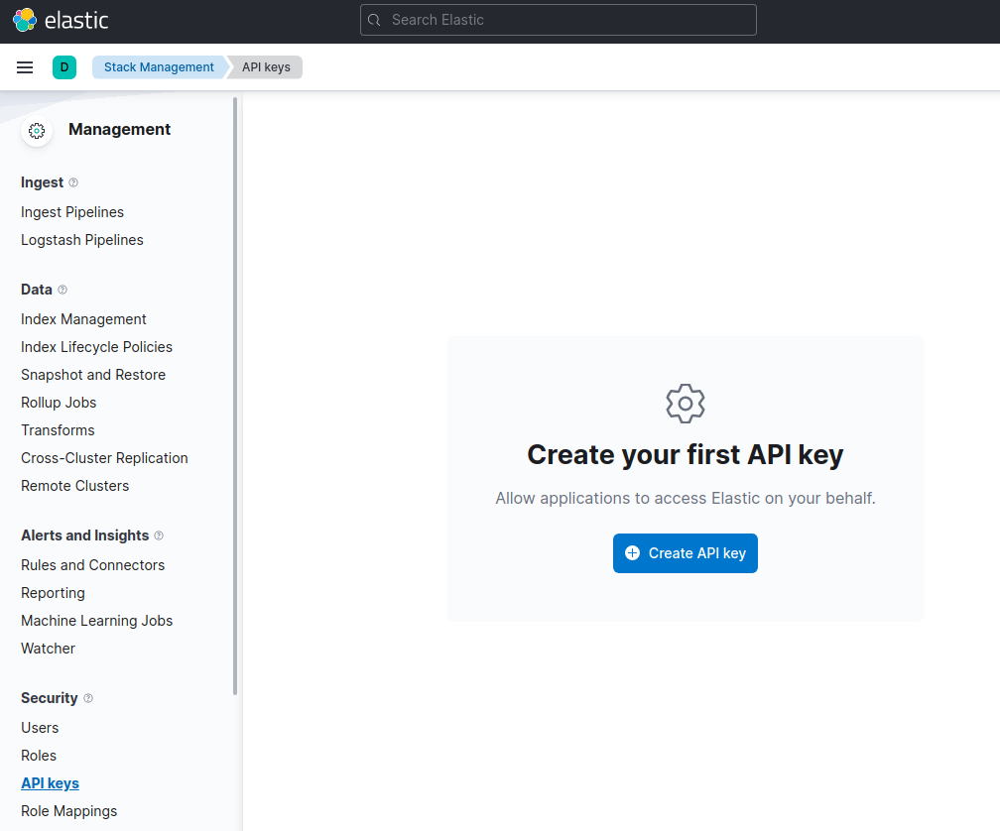

---
mapped_pages:
  - https://www.elastic.co/guide/en/elasticsearch/client/java-api-client/current/getting-started-java.html
navigation_title: Getting started
---

# Getting started with the {{es}} Java client

This page guides you through the installation process of the Java client, shows you how to instantiate the client, and how to perform basic Elasticsearch operations with it.

### Requirements

Java 17 or later.

### Installation


#### Installation in a Gradle project

```groovy subs=true
dependencies {
    implementation 'co.elastic.clients:elasticsearch-java:{{version}}'
}
```


#### Installation in a Maven project

In the `pom.xml` of your project, add the following repository definition and dependencies:

```xml subs=true
<project>
  <dependencies>

    <dependency>
      <groupId>co.elastic.clients</groupId>
      <artifactId>elasticsearch-java</artifactId>
      <version>{{version}}</version>
    </dependency>

  </dependencies>
</project>
```

Refer to the [Installation](setup/installation.md) page to learn more.


### Connecting

You can connect to the Elastic Cloud using an API key and the Elasticsearch endpoint.

% :::{include-code} src={{doc-tests-src}}/getting_started/ConnectingTest.java tag=create-client
```java
// URL and API key
String serverUrl = "https://localhost:9200";
String apiKey = "VnVhQ2ZHY0JDZGJrU...";

ElasticsearchClient esClient = ElasticsearchClient.of(b -> b
    .host(serverUrl)
    .apiKey(apiKey)
);

// Use the client...

// Close the client, also closing the underlying transport object and network connections.
esClient.close();
```

Your Elasticsearch endpoint can be found on the **My deployment** page of your deployment:


You can generate an API key on the **Management** page under Security.



For other connection options, refer to the [Connecting](setup/connecting.md) section.


### Operations [_operations]

Time to use Elasticsearch! This section walks you through the basic, and most important, operations of Elasticsearch. For more operations and more advanced examples, refer to the [*Using the Java API Client*](usage/index.md) page.


#### Creating an index [_creating_an_index]

This is how you create the `product` index:

% :::{include-code} src={{doc-tests-src}}/usage/IndexingTest.java tag=create-products-index
```java
esClient.indices().create(c -> c
    .index("products")
);
```


#### Indexing documents [_indexing_documents]

This is a simple way of indexing a document, here a `Product` application object:

% :::{include-code} src={{doc-tests-src}}/usage/IndexingTest.java tag=single-doc-dsl
```java
Product product = new Product("bk-1", "City bike", 123.0);

IndexResponse response = esClient.index(i -> i
    .index("products")
    .id(product.getSku())
    .document(product)
);

logger.info("Indexed with version " + response.version());
```

#### Getting documents [_getting_documents]

You can get documents by using the following code:

% :::{include-code} src={{doc-tests-src}}/usage/ReadingTest.java tag=get-by-id
```java
GetResponse<Product> response = esClient.get(g -> g
    .index("products") // <1>
    .id("bk-1"),
    Product.class      // <2>
);

if (response.found()) {
    Product product = response.source();
    logger.info("Product name " + product.getName());
} else {
    logger.info ("Product not found");
}
```

1. The get request, with the index name and identifier.
2. The target class, here `Product`.

#### Searching documents [_searching_documents]

This is how you can create a single match query with the Java client:

% :::{include-code} src={{doc-tests-src}}/usage/SearchingTest.java tag=search-getting-started
```java
String searchText = "bike";

SearchResponse<Product> response = esClient.search(s -> s
        .index("products")
        .query(q -> q
            .match(t -> t
                .field("name")
                .query(searchText)
            )
        ),
    Product.class
);
```

#### Updating documents [_updating_documents]

This is how you can update a document, for example to add a new field:

% :::{include-code} src={{doc-tests-src}}/usage/IndexingTest.java tag=single-doc-update
```java
Product product = new Product("bk-1", "City bike", 123.0);

esClient.update(u -> u
        .index("products")
        .id("bk-1")
        .upsert(product),
    Product.class
);
```

#### Deleting documents [_deleting_documents]

% :::{include-code} src={{doc-tests-src}}/usage/IndexingTest.java tag=single-doc-delete
```java
esClient.delete(d -> d.index("products").id("bk-1"));
```

#### Deleting an index [_deleting_an_index]

% :::{include-code} src={{doc-tests-src}}/usage/IndexingTest.java tag=delete-products-index
```java
esClient.indices().delete(d -> d
    .index("products")
);
```

## Examples [_examples]

The [examples](https://github.com/elastic/elasticsearch-java/tree/main/examples) folder in the Github repository contains full working examples showing how to set up and use the client.


## Further reading [_further_reading]

* Learn more about the [*API conventions*](api-conventions/index.md) of the Java client.
