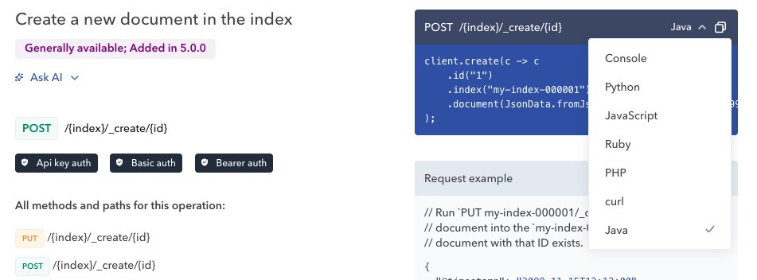

---
mapped_pages:
  - https://www.elastic.co/guide/en/elasticsearch/client/java-api-client/current/usage.html
---

# Using the Java API client [usage]

## Code Examples

The Elasticsearch [API reference](https://www.elastic.co/docs/api/doc/elasticsearch/) provides examples of requests in various languages, including Java, available in the dropdown menu on the right.

## General Usage
The sections below provide tutorials on the most frequently used and some less obvious features of {{es}}.

For a full reference, see the [Elasticsearch documentation](docs-content://get-started/index.md) and in particular the [REST APIs](elasticsearch://reference/elasticsearch/rest-apis/index.md) section. The Java API Client follows closely the JSON structures described there, using the [Java API conventions](/reference/api-conventions/index.md).

If you’re new to Elasticsearch, make sure also to read [Elasticsearch’s quick start](docs-content://solutions/search/get-started.md) that provides a good introduction.

* [ES|QL in the Java client](/reference/usage/esql.md)
* [Indexing single documents](/reference/usage/indexing.md)
* [Bulk: indexing multiple documents](/reference/usage/indexing-bulk.md)
* [Reading documents by id](/reference/usage/reading.md)
* [Searching for documents](/reference/usage/searching.md)
* [Aggregations](/reference/usage/aggregations.md)

::::{note}
This is still a work in progress, more sections will be added in the near future.
::::

